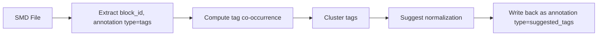

# Semantic Markdown (SMD) — Specification v0.0

> A block-addressable document format for human-agent collaboration, with semantic overlays and emergent structure.

**Status:** Active Research  
**Last updated:** 2026-06-09  
**Extension:** `.smd`  
**MIME:** `text/vnd.semantic-markdown` (pending IANA registration)

---

## Table of Contents

- [0. Conformance Levels](#0-conformance-levels)
- [1. Design Principles](#1-design-principles)
- [2. Primitives](#2-primitives)
- [3. SMD as a Typed Document Graph](#3-smd-as-a-typed-document-graph)
- [4. Separator Rules](#4-separator-rules)
- [5. Formal Grammar (EBNF)](#5-formal-grammar-ebnf)
- [6. Body Content Parsing](#6-body-content-parsing)
- [7. Parser Algorithm](#7-parser-algorithm)
- [8. Identifiers](#8-identifiers)
- [9. Nesting Conventions](#9-nesting-conventions-not-format-rules)
- [10. Use Cases](#10-use-cases)
- [11. Viewer Semantics](#11-viewer-semantics-non-normative)
- [12. Query and Retrieval Model](#12-query-and-retrieval-model)
- [13. Clustering Pipelines](#13-clustering-pipelines)
- [14. Comparison with Alternatives](#14-comparison-with-alternatives)
- [15. Error Handling](#15-error-handling)
- [16. Schema Versioning](#16-schema-versioning)
- [17. Future Considerations](#17-future-considerations)
- [18. License](#18-license)

---

## 0. Conformance Levels

This specification uses the key words **MUST**, **SHOULD**, and **MAY** as defined in [RFC 2119](https://tools.ietf.org/html/rfc2119).

- **MUST**: Required for valid SMD. Parsers MUST reject documents that violate these rules.
- **SHOULD**: Recommended for interoperability. Parsers SHOULD warn on deviation.
- **MAY**: Optional extensions. Implementations MAY choose to support or ignore these behaviors.

| Rule | Level | Scope |
|---|---|---|
| `block_id` unique within document | MUST | All blocks |
| JSON header is valid RFC 8259 | MUST | All entities |
| `---` separator present after header | MUST | All entities |
| `@document`/`@block` at line start | MUST | Parser |
| `document_id` on @document | SHOULD | Document |
| `schema_version` on @document | SHOULD | Document |
| Block body present (may be empty) | MUST | All blocks |
| Annotations carry provenance | SHOULD | Annotation producers |
| Viewers interpret annotations | MAY | Viewer |
| Cross-document aggregation | MAY | Viewer / Indexer |
| Clustering pipelines | MAY | External tools |

---

## 1. Design Principles

SMD treats documents as structured data artifacts, not passive text containers.

1. **Minimal primitives.** Two constructs (`@document`, `@block`), one separator (`---`). Everything else is convention.

2. **No enforced hierarchy model.** Nesting, trees, graphs, timelines — all expressed through conventional use of `block_id`, annotations (`type: "tags"`), and typed edges (`parent-of`). Hierarchy primitives exist (the `parent-of` edge type) but the format does not mandate a specific structure. The format defines the alphabet; users define the grammar.

3. **Conventions over protocols.** The format does not enforce a nesting schema. An ecosystem of conventions can emerge (e.g., `block_level=N` tag, path-based IDs, parent pointers).

4. **Bottom-up discoverable.** Tags are free-form. Structure can emerge from clustering, not just from author intent.

5. **Triple-consumable.** Designed for humans (readable Markdown), agents (parseable JSON headers), and viewers (renderable semantic overlays).

6. **Three-layer architecture.** SMD is defined across three explicit layers:

   - **Syntax layer** — `@document`, `@block`, `---` separator, EBNF grammar. What a valid `.smd` file looks like.
   - **Data model layer** — JSON schemas for documents and blocks (`block_id`, `document_id`, `body`, `meta`). What structured information each entity carries.
   - **Interaction layer** — Annotations, viewer projections, clustering pipelines, cross-document aggregation. How systems read, write, and evolve SMD documents.

   These layers are separable: a parser can validate syntax without understanding data model semantics. An agent can annotate blocks without changing rendering. A viewer can render without running clustering pipelines.

---

## 2. Primitives

### 2.1 `@document`

The top-level container. A document has one JSON header and an optional Markdown body.

```
@document
{
    "document_id": "<string>",
    "schema_version": "<string>",
    "created": "<ISO 8601 timestamp>",
    "source": "<string>",
    "type": "<string>",
    "meta": { <any> }
}
---
<body (optional)>
```

**Fields:**

| Field | Requirement | Description |
|---|---|---|
| `document_id` | **REQUIRED** | Globally unique identifier. UUIDv7 recommended. |
| `schema_version` | RECOMMENDED | Format version for migration support. |
| `created` | RECOMMENDED | ISO 8601 timestamp of creation. |
| `source` | OPTIONAL | Origin of the document (e.g., filename, URL). |
| `type` | RECOMMENDED | Semantic type. Examples: `transcript`, `notebook`, `article`, `log`, `corpus`. |
| `meta` | OPTIONAL | Application-specific metadata object. |

The body is optional — a document may exist solely as a container for blocks.

### 2.2 `@block`

A content unit — the fundamental addressable entity in SMD. A block is **minimal by design**:

```
Block = {
  block_id:    string,        // REQUIRED — unique within document
  document_id?: string,        // OPTIONAL — reference to parent document
  body:         string,        // REQUIRED — Markdown content (may be empty string)
  meta?:        object         // OPTIONAL — application-specific metadata
}
```

```smd
@block
{
    "block_id": "<string>",
    "document_id": "<string>",
    "meta": { <any> }
}
---
<body>
```

**Fields:**

| Field | Requirement | Description |
|---|---|---|
| `block_id` | **REQUIRED** | Unique within the containing document. |
| `document_id` | OPTIONAL | Reference to parent document. |
| `meta` | OPTIONAL | Application-specific metadata. |

The body is **REQUIRED** for `@block` (may be empty string).

**Everything else — type, tags, sentiment, entities, structure, summaries, highlights — is represented via [annotations](#23-annotation-model) or external edges (see [§3](#3-smd-as-a-typed-document-graph)).** This keeps the core format minimal and the extension surface unbounded.

### 2.3 Annotation Model

Annotations are optional, schema-free overlays on blocks. They carry everything that is not part of the block's core identity (id + body).

```json
{
  "annotation": {
    "type": "string",
    "payload": {},
    "provenance": {
      "source": "string",
      "model": "string",
      "timestamp": "ISO-8601"
    }
  }
}
```

**Fields:**

| Field | Requirement | Description |
|---|---|---|
| `type` | **REQUIRED** | Annotation kind. Examples: `sentiment`, `tags`, `summary`, `entities`, `highlights`, `edge`. |
| `payload` | **REQUIRED** | Arbitrary JSON — the annotation's data. Schema is defined by `type`. |
| `provenance.source` | RECOMMENDED | Origin: `human`, agent name, pipeline identifier, or tool. |
| `provenance.model` | OPTIONAL | Model or algorithm that produced this annotation. |
| `provenance.timestamp` | RECOMMENDED | ISO-8601 timestamp of when the annotation was created. |

**Design properties:**

- **Schema-free.** No fixed schema for `payload`. Each `type` defines its own contract.
- **Provenance-tracked.** Every annotation records its origin, enabling audit trails and conflict resolution.
- **Mutable independently.** Annotations can be added, updated, or removed without touching the block body.
- **Multi-source.** Multiple annotations of the same `type` from different sources can coexist.
- **External or inline.** Annotations MAY be stored in a block's `meta` field, in a sidecar file, or in an external annotation store.

**Example — sentiment and tags as annotations:**

```smd
@block
{
    "block_id": "qa-0001",
    "meta": {
        "annotations": [
            {
                "type": "sentiment",
                "payload": {
                    "excerpt": "Guidance beat consensus by ~2%.",
                    "score": 0.74,
                    "label": "positive",
                    "confidence": 0.88
                },
                "provenance": {
                    "source": "sentiment-agent-v2",
                    "model": "finbert-sentiment",
                    "timestamp": "2026-06-07T18:30:00Z"
                }
            },
            {
                "type": "tags",
                "payload": { "values": ["guidance", "revenue"] },
                "provenance": {
                    "source": "human",
                    "timestamp": "2026-06-07T18:35:00Z"
                }
            }
        ]
    }
}
---
**Michael Ng:** Can you talk about Q4 guidance?
```

---

## 3. SMD as a Typed Document Graph

An SMD document is formally defined as a typed, attributed graph:

```
SMD Document = G = (V, E, A)

  V = Blocks                    — vertices are @block entities
  E = Typed edges over V × V    — relationships between blocks
  A = Annotations over V ∪ E    — schema-free overlays on vertices and edges
```

### 3.1 Edge Types

Edges are typed relationships between blocks. The following edge types are recognized:

| Edge Type | Semantics | Example |
|---|---|---|
| `parent-of` | Hierarchical containment. A contains B. | Section → Subsection |
| `references` | Cross-reference. A cites or mentions B. | Analysis block → Source block |
| `derived-from` | Provenance chain. A was generated or extracted from B. | Summary block → Transcript block |
| `temporal-order` | Temporal sequencing. A precedes B in time. | Day entry N → Day entry N+1 |

Additional edge types MAY be defined by applications.

### 3.2 Edge Representation

Edges are annotations with `type: "edge"`:

```json
{
  "type": "edge",
  "payload": {
    "edge_type": "parent-of",
    "source": "sec-methodology",
    "target": "sec-wacc"
  },
  "provenance": {
    "source": "structure-agent",
    "timestamp": "2026-06-07T18:30:00Z"
  }
}
```

Edges MAY be stored:
- In the source block's `meta.annotations`
- In a dedicated `@document`-level annotation block
- In an external edge index

### 3.3 Why a Graph?

- **Trees are insufficient.** Documents contain cross-references, temporal sequences, and derivation chains that trees cannot express.
- **Edges are typed.** Unlike generic hyperlinks, typed edges carry semantics that algorithms can reason about.
- **Annotations attach anywhere.** Sentiment, tags, summaries — all overlay the graph without polluting the vertex schema.
- **Structure is emergent.** The graph is discovered or declared, not mandated by the format.

---

## 4. Separator Rules

### 4.1 Entity start

An SMD file is parsed by scanning for lines that match `^@document` or `^@block` at the start of a line. The parser assumes that `@document` and `@block` always begin at the start of a line with no preceding whitespace.

### 4.2 Header–body separator

The **first** occurrence of `^---$` (three dashes on their own line) after the `@document`/`@block` line ends the JSON header and begins the body. Only a `---` line that appears in the header-body boundary context is treated as a separator — `---` lines within body content (e.g., Markdown horizontal rules, code blocks) are part of the body and have no structural significance.

```
@block
{
    "block_id": "b-001"
}
---              ← separator (line containing only "---")
Content body     ← body (Markdown)
```

### 4.3 Body termination

A block/document body is terminated by:
- The next `@document` or `@block` line
- End of file

---

## 5. Formal Grammar (EBNF)

```ebnf
smd_file        = { entity } , EOF;

entity          = document | block;

document        = "@document", newline, json_header, separator, body;
block           = "@block", newline, json_header, separator, body;

json_header     = valid_json_object ;  (* MUST be valid RFC 8259 JSON *)
separator       = newline, "---", newline;
body            = { any_character };

newline         = "\n" | "\r\n";
any_character   = ? any Unicode character except EOF ?;
```

This grammar defines syntactic structure only. It does not define semantic validity of JSON fields or annotation schemas.

The JSON header MUST be a valid JSON object as defined by [RFC 8259](https://tools.ietf.org/html/rfc8259).

---

## 6. Body Content Parsing

The body parser recognizes **triple-backtick fenced sections** with an optional content type label. The body is split into an ordered list of typed segments. Body parsing MUST operate on raw text after the separator, not on a rendered Markdown AST.

### 6.1 Markdown segments

Raw Markdown text between fenced blocks is parsed as `type: "markdown"`.

### 6.2 Fenced segments

Content between ` ```type ... ``` ` is extracted as a typed payload:

```
@block { "block_id": "b-001" }
---
Some markdown content...

```thought
This is my internal thinking about this topic.
```

```action_item
Review AMD MI350 benchmarks.
Assigned to: Bob
Due: 2026-07-01
```
```

The parser produces:

```json
[
  { "type": "markdown", "content": "Some markdown content...\n\n" },
  { "type": "thought", "content": "This is my internal thinking..." },
  { "type": "markdown", "content": "\n" },
  { "type": "action_item", "content": "Review AMD MI350 benchmarks..." }
]
```

---

## 7. Parser Algorithm

```
function parse_smd(text: string): Entity[] {
    entities = []

    // 1. Split on @document or @block at line start (positive lookahead)
    raw_blocks = text.split(/^(?=@(?:document|block))/m)

    for raw in raw_blocks:
        if raw matches "^@document" or raw matches "^@block":
            entity = {}

            // 2. Determine entity type
            entity.type = raw matches "@document" ? "document" : "block"

            // 3. Locate first --- separator
            sep_pos = raw.indexOf("\n---\n")
            if sep_pos == -1:
                raise ParseError("Missing '---' separator")

            // 4. Extract JSON header (between @ line and separator)
            header_start = raw.indexOf("\n") + 1
            header_text = raw[header_start:sep_pos].trim()
            entity.header = JSON.parse(header_text)

            // 5. Extract body (after separator)
            body_text = raw[sep_pos + 5:].trim()
            entity.segments = parse_body(body_text)

            entities.append(entity)

    return entities
}
```

**Time complexity:** O(n) — single pass, no backtracking.

---

## 8. Identifiers

### 8.1 `block_id`

- **REQUIRED** on every `@block`.
- MUST be unique within the containing document.
- Global uniqueness is achieved via the `(document_id, block_id)` tuple. When blocks are moved across documents, the `document_id` MUST be updated to reflect the new owning document.
- RECOMMENDED conventions: UUIDv7 (time-sortable), slugs (`qa-0042`, `day-2026-01-15`), or path-like identifiers (`section/methodology/wacc`).

### 8.2 `document_id`

- **REQUIRED** on every `@document`.
- RECOMMENDED: UUIDv7 or a unique slug.

### 8.3 Referencing

Blocks reference each other via typed edges (see [§3](#3-smd-as-a-typed-document-graph)). The `parent-of` edge type establishes hierarchy:

```
@block { "block_id": "ch-1" }
---
## Overview

@block
{
    "block_id": "sec-1",
    "meta": {
        "annotations": [
            {
                "type": "edge",
                "payload": { "edge_type": "parent-of", "source": "ch-1", "target": "sec-1" },
                "provenance": { "source": "human", "timestamp": "2026-01-01T00:00:00Z" }
            }
        ]
    }
}
---
### Details
```

---

## 9. Nesting Conventions (Not Format Rules)

SMD does not have built-in nesting. The following conventions are recognized patterns:

### 9.1 Explicit parent edge

```smd
@block
{
    "block_id": "sec-1-1",
    "meta": {
        "annotations": [
            {
                "type": "edge",
                "payload": { "edge_type": "parent-of", "source": "ch-1", "target": "sec-1-1" },
                "provenance": { "source": "human" }
            }
        ]
    }
}
---
### Section 1.1
```

### 9.2 Tag-based level

```smd
@block
{
    "block_id": "h1",
    "meta": {
        "annotations": [
            {
                "type": "tags",
                "payload": { "values": ["block_level=1"] },
                "provenance": { "source": "human" }
            }
        ]
    }
}
---
# Chapter 1

@block
{
    "block_id": "h2",
    "meta": {
        "annotations": [
            {
                "type": "tags",
                "payload": { "values": ["block_level=2"] },
                "provenance": { "source": "human" }
            }
        ]
    }
}
---
## Section 1.1
```

A viewer can reconstruct a tree by grouping on `block_level` tag values.

### 9.3 Path-based `block_id`

```smd
@block { "block_id": "2026/06/07/note-1" }
@block { "block_id": "section/methodology/wacc" }
```

The `/` separator is a convention — viewers MAY split on `/` to build a tree.

### 9.4 Namespaced tags

```smd
@block
{
    "block_id": "b1",
    "meta": {
        "annotations": [
            {
                "type": "tags",
                "payload": { "values": ["section:intro"] },
                "provenance": { "source": "human" }
            }
        ]
    }
}
---

@block
{
    "block_id": "b2",
    "meta": {
        "annotations": [
            {
                "type": "tags",
                "payload": { "values": ["section:body", "sub:methodology"] },
                "provenance": { "source": "human" }
            }
        ]
    }
}
---
```

Clustering pipelines can discover hierarchy from tag name conventions.

---

## 10. Use Cases

### 10.1 Earnings Transcript (Q&A blocks)

```smd
@document
{
    "document_id": "aapl-q3-2026",
    "schema_version": "0.0",
    "created": "2026-06-07T18:30:00Z",
    "source": "AAPL Q3 2026 Earnings Call",
    "meta": {
        "ticker": "AAPL",
        "fiscal_quarter": "Q3",
        "fiscal_year": 2026
    }
}
---
@block
{
    "block_id": "qa-0001",
    "meta": {
        "annotations": [
            {
                "type": "tags",
                "payload": { "values": ["guidance", "revenue"] },
                "provenance": { "source": "human", "timestamp": "2026-06-07T18:30:00Z" }
            },
            {
                "type": "sentiment",
                "payload": {
                    "excerpt": "Guidance beat consensus by ~2%. Services growth continues.",
                    "score": 0.74,
                    "label": "positive",
                    "confidence": 0.88
                },
                "provenance": { "source": "sentiment-agent-v2", "model": "finbert-sentiment", "timestamp": "2026-06-07T18:31:00Z" }
            },
            {
                "type": "summary",
                "payload": { "text": "Guidance beat consensus by ~2%. Services growth continues." },
                "provenance": { "source": "summarizer", "model": "gpt-4", "timestamp": "2026-06-07T18:32:00Z" }
            },
            {
                "type": "entities",
                "payload": { "values": ["AAPL", "Services"] },
                "provenance": { "source": "ner-agent", "timestamp": "2026-06-07T18:31:00Z" }
            },
            {
                "type": "speaker",
                "payload": { "name": "Michael Ng", "role": "Analyst", "affiliation": "Goldman Sachs" },
                "provenance": { "source": "human", "timestamp": "2026-06-07T18:30:00Z" }
            }
        ]
    }
}
---
**Michael Ng:** Can you talk about Q4 guidance?

**Luca Maestri:** We expect low double digits...

@block
{
    "block_id": "qa-0002",
    "meta": {
        "annotations": [
            {
                "type": "tags",
                "payload": { "values": ["AI", "capex"] },
                "provenance": { "source": "human", "timestamp": "2026-06-07T18:33:00Z" }
            },
            {
                "type": "sentiment",
                "payload": {
                    "excerpt": "We're investing significantly...",
                    "score": 0.91,
                    "label": "very positive",
                    "confidence": 0.95
                },
                "provenance": { "source": "sentiment-agent-v2", "model": "finbert-sentiment", "timestamp": "2026-06-07T18:33:00Z" }
            },
            {
                "type": "speaker",
                "payload": { "name": "Erik Woodring", "role": "Analyst", "affiliation": "Morgan Stanley" },
                "provenance": { "source": "human", "timestamp": "2026-06-07T18:33:00Z" }
            }
        ]
    }
}
---
**Erik Woodring:** On AI capex?

**Tim Cook:** We're investing significantly...
```

### 10.2 Financial Notebook (day blocks)

One file, many dated entries:

```smd
@document
{
    "document_id": "research-aapl-2026",
    "schema_version": "0.0",
    "meta": { "title": "AAPL Research Notes" }
}
---
@block
{
    "block_id": "day-2026-01-15",
    "meta": {
        "annotations": [
            {
                "type": "tags",
                "payload": { "values": ["valuation", "dcf"] },
                "provenance": { "source": "human", "timestamp": "2026-01-15T09:00:00Z" }
            },
            {
                "type": "mood",
                "payload": { "value": "bullish" },
                "provenance": { "source": "human", "timestamp": "2026-01-15T09:00:00Z" }
            },
            {
                "type": "edge",
                "payload": { "edge_type": "temporal-order", "source": "day-2026-01-15", "target": "day-2026-03-22" },
                "provenance": { "source": "structure-agent", "timestamp": "2026-06-09T00:00:00Z" }
            }
        ]
    }
}
---
Updated DCF model today. WACC lowered to 9.2%.

**TODO:** Review Services revenue breakdown.

@block
{
    "block_id": "day-2026-03-22",
    "meta": {
        "annotations": [
            {
                "type": "tags",
                "payload": { "values": ["ai", "capex", "valuation"] },
                "provenance": { "source": "human", "timestamp": "2026-03-22T14:00:00Z" }
            },
            {
                "type": "mood",
                "payload": { "value": "neutral" },
                "provenance": { "source": "human", "timestamp": "2026-03-22T14:00:00Z" }
            }
        ]
    }
}
---
AI capex $15B announced.

```thought
This impacts FCF. Need to adjust model.
```
```

### 10.3 Collaborative Research (multi-author)

```smd
@document { "document_id": "semi-research", "schema_version": "0.0" }
---
@block
{
    "block_id": "note-alice-001",
    "meta": {
        "annotations": [
            {
                "type": "author",
                "payload": { "name": "Alice" },
                "provenance": { "source": "human", "timestamp": "2026-06-05T10:00:00Z" }
            },
            {
                "type": "tags",
                "payload": { "values": ["nvda", "datacenter"] },
                "provenance": { "source": "human", "timestamp": "2026-06-05T10:00:00Z" }
            },
            {
                "type": "edge",
                "payload": { "edge_type": "derived-from", "source": "note-bob-001", "target": "note-alice-001" },
                "provenance": { "source": "human", "timestamp": "2026-06-06T16:00:00Z" }
            }
        ]
    }
}
---
NVDA datacenter revenue grew 140% YoY.

```action_item
Review AMD MI350 benchmarks. Assigned to: Bob
```

@block
{
    "block_id": "note-bob-001",
    "meta": {
        "annotations": [
            {
                "type": "author",
                "payload": { "name": "Bob" },
                "provenance": { "source": "human", "timestamp": "2026-06-06T16:00:00Z" }
            },
            {
                "type": "tags",
                "payload": { "values": ["amd", "mi350"] },
                "provenance": { "source": "human", "timestamp": "2026-06-06T16:00:00Z" }
            },
            {
                "type": "status",
                "payload": { "value": "in_progress" },
                "provenance": { "source": "human", "timestamp": "2026-06-06T16:00:00Z" }
            }
        ]
    }
}
---
MI350 has 2.4 TB/s memory bandwidth vs NVDA 2.0 TB/s.
```

### 10.4 RAG Corpus (semantic chunks)

```smd
@document { "document_id": "fed-minutes-2026-05", "schema_version": "0.0" }
---
@block
{
    "block_id": "sec-inflation",
    "meta": {
        "annotations": [
            {
                "type": "tags",
                "payload": { "values": ["inflation", "cpi", "policy"] },
                "provenance": { "source": "indexer", "timestamp": "2026-05-15T12:00:00Z" }
            },
            {
                "type": "summary",
                "payload": { "text": "Fed expresses caution on inflation persistence" },
                "provenance": { "source": "summarizer", "model": "gpt-4", "timestamp": "2026-05-15T12:01:00Z" }
            },
            {
                "type": "entities",
                "payload": { "values": ["CPI", "PCE", "fed funds rate"] },
                "provenance": { "source": "ner-agent", "timestamp": "2026-05-15T12:01:00Z" }
            }
        ]
    }
}
---
Participants noted that inflation remains elevated...

@block
{
    "block_id": "sec-labor",
    "meta": {
        "annotations": [
            {
                "type": "tags",
                "payload": { "values": ["labor", "employment"] },
                "provenance": { "source": "indexer", "timestamp": "2026-05-15T12:00:00Z" }
            },
            {
                "type": "summary",
                "payload": { "text": "Labor market remains tight" },
                "provenance": { "source": "summarizer", "model": "gpt-4", "timestamp": "2026-05-15T12:01:00Z" }
            }
        ]
    }
}
---
The labor market remains tight...
```

---

## 11. Viewer Semantics (Non-Normative)

Rendering is a **projection function** and is not part of the SMD validity model:

```
P(view) : (V, E, A) → UI
```

Where `(V, E, A)` is the SMD document graph (see [§3](#3-smd-as-a-typed-document-graph)) and `UI` is an arbitrary user interface representation.

### 11.1 Non-Normative Status

- SMD **MUST NOT** define colors, UI layouts, or rendering rules.
- SMD **MUST NOT** require specific visual treatments of annotations.
- Renderers **MAY** interpret annotations however they want — as overlays, sidebars, filters, or ignore them entirely.
- The format defines *what* data is available; renderers define *how* to display it.

### 11.2 Common Rendering Patterns (Informative)

The following patterns are observed in practice but are **not required**:

- **Tag-based filtering:** Extract annotation `type: "tags"` payloads to build filter interfaces.
- **Sentiment gradients:** Map annotation `type: "sentiment"` scores to color scales.
- **Entity linking:** Hyperlink annotation `type: "entities"` payload values.
- **Edge visualization:** Render `type: "edge"` annotations as connector lines or hierarchy trees.
- **Cross-document aggregation:** Scan annotations across multiple `.smd` files for global views.

### 11.3 Viewer Architecture (Informative)

```
┌──────────────┐     ┌──────────────────┐     ┌───────────────────┐
│  .smd files   │────▶│  Parser          │────▶│  Viewer           │
│  (one or     │     │  (V, E, A)       │     │                   │
│  many)       │     │                   │     │  P(view): graph   │
│              │     │  V = blocks      │     │  → UI projection  │
│              │     │  E = edges       │     │                   │
│              │     │  A = annotations │     │  (colors, layout, │
│              │     │                   │     │   filters, etc.) │
└──────────────┘     └──────────────────┘     └───────────────────┘
```

A viewer may be **stateless** per document or **stateful** across documents. Cross-document features (clustering, aggregation, tag normalization) MAY introduce external indexing layers.

---

## 12. Query and Retrieval Model

Queries operate over the document graph `(V, E, A)`, not over raw text. SMD defines a minimal query algebra:

```
Q :=
    filter(annotation_type, predicate)
  | traverse(edge_type, direction?)
  | match(text_query)
  | embed_search(vector)
  | aggregate(metric, group?)
```

### 12.1 Query Operators

| Operator | Signature | Description |
|---|---|---|
| `filter` | `filter(type, pred) → V'` | Select blocks where an annotation of `type` matches `pred`. Example: `filter("sentiment", score > 0.7)` |
| `traverse` | `traverse(edge_type, dir?) → V'` | Follow typed edges from a set of blocks. `dir` is `out` (default), `in`, or `both`. Example: `traverse("parent-of", out)` |
| `match` | `match(query) → V'` | Full-text or regex match over block bodies. |
| `embed_search` | `embed_search(vector) → V'` | Semantic (vector) similarity search over block bodies or annotation payloads. |
| `aggregate` | `aggregate(metric, group?) → scalar \| map` | Compute `count`, `sum`, `avg`, `min`, `max` over annotation payloads, optionally grouped. |

### 12.2 Composition

Queries compose via piping:

```
filter("tags", contains("valuation"))
  → traverse("references", out)
  → filter("sentiment", score < 0.3)
```

This reads as: "Find valuation-tagged blocks, follow their references, and return those with negative sentiment."

### 12.3 Retrieval-Augmented Generation (RAG)

SMD is designed for RAG retrieval with graph context:

```
┌──────────────────┐     ┌──────────────────┐     ┌──────────────────┐
│  User query      │────▶│  embed_search()  │────▶│  traverse()      │
│                  │     │  → top-k blocks  │     │  → neighbor      │
│                  │     │                  │     │    blocks        │
└──────────────────┘     └──────────────────┘     └────────┬─────────┘
                                                           │
                                                           ▼
┌──────────────────┐     ┌──────────────────────────────────────────┐
│  LLM response    │◀────│  Build context window from blocks +      │
│                  │     │  annotations + edges                     │
└──────────────────┘     └──────────────────────────────────────────┘
```

The graph structure `(V, E, A)` means retrieval is never limited to isolated text chunks — neighbor blocks, typed edges, and annotations are always available for context assembly.

### 12.4 Implementation Note

This query algebra is **a specification, not a mandated implementation**. Systems MAY implement it via:
- In-memory graph traversal (small documents)
- SQL/vector hybrid stores (production scale)
- Custom query compilers targeting specific backends

---

## 13. Clustering Pipelines

Because annotations carry free-form payloads, SMD is naturally amenable to bottom-up structure discovery.

### 13.1 Tag clustering pipeline



### 13.2 Example output

```
Input blocks:
  b1: ["dcf", "valuation", "wacc"]
  b2: ["dcf model", "valuation", "terminal growth"]
  b3: ["ai", "capex"]
  b4: ["ai", "nvda", "chip"]
  b5: ["amd", "mi350", "chip"]

Cluster 1: "valuation" → normalize "dcf", "dcf model" → "dcf"
Cluster 2: "ai_capex" → normalize "ai", "capex" → "ai_capex"
Cluster 3: "competition" → normalize "nvda", "amd", "mi350", "chip" → "competition"
```

### 13.3 Feedback loop

```smd
@block
{
    "block_id": "b1",
    "meta": {
        "annotations": [
            {
                "type": "tags",
                "payload": { "values": ["dcf", "valuation"] },
                "provenance": { "source": "human" }
            },
            {
                "type": "suggested_tags",
                "payload": { "values": ["dcf"] },
                "provenance": { "source": "clustering-pipeline", "timestamp": "2026-06-09T00:00:00Z" }
            },
            {
                "type": "cluster",
                "payload": { "group": "valuation_group" },
                "provenance": { "source": "clustering-pipeline", "timestamp": "2026-06-09T00:00:00Z" }
            }
        ]
    }
}
```

No format changes needed — the pipeline writes into the existing `meta.annotations` field.

---

## 14. Comparison with Alternatives

| Feature | Plain MD | JSON | YAML+MD (Frontmatter) | MDX | SMD |
|---|---|---|---|---|---|
| Human-readable body | ✅ | ❌ | ✅ | ✅ | ✅ |
| Machine-parseable metadata | ❌ | ✅ | ✅ (file-level) | ❌ | ✅ (block-level) |
| Block-level addressing | ❌ | ❌ | ❌ | ❌ | ✅ (`block_id`) |
| Block-level annotations | ❌ | ✅ | ❌ | ❌ | ✅ |
| Semantic overlays | ❌ | ❌ | ❌ | ❌ | ✅ |
| Emergent clustering | ❌ | Partial | ❌ | ❌ | ✅ |
| External annotation layer | ❌ | ❌ | ❌ | ❌ | ✅ (annotation model) |
| Typed document graph | ❌ | ❌ | ❌ | ❌ | ✅ (V, E, A) |
| Formal query algebra | ❌ | ❌ | ❌ | ❌ | ✅ |
| Git-friendly | ✅ | ✅ | ✅ | ✅ | ✅ |
| No proprietary tools | ✅ | ✅ | ✅ | ❌ (JSX) | ✅ |
| Structure via edges | ❌ | ❌ | ❌ | ❌ | ✅ (typed edges) |
| Semantic retrieval at scale | ❌ | ❌ | ❌ | ❌ | ✅ |

---

## 15. Error Handling

| Condition | Behavior |
|---|---|
| `@block` with no `---` separator | Raise `ParseError`. Invalid document. |
| Malformed JSON in header | Raise `ParseError` with line number. |
| Duplicate `block_id` within document | Raise `ParseError`. |
| `@document` inside another document | Parsed as a new document (sequential, not nested). |
| Unknown fenced block type | Treated as plain markdown in body, but typed segment is still emitted. |
| Empty body | Valid. `segments` is an empty list. |

---

## 16. Schema Versioning

The `schema_version` field on `@document` enables format evolution while maintaining backward compatibility.

### 16.1 Versioning Rules

- **Minor version changes** (e.g., `0.1` → `0.2`) MUST be backward compatible at the parser level. Documents written for an older minor version MUST parse successfully under a newer minor version.
- **Major version changes** (e.g., `0.x` → `1.0`) MAY introduce breaking changes. Parsers SHOULD reject documents with an unsupported major version.
- **Pre-1.0** (current): All `0.x` versions are considered experimental. Breaking changes between `0.x` releases SHOULD be documented but are permitted.

### 16.2 Migration

When a new schema version introduces changes to the data model, migration tools MAY transform documents by:

1. Parsing the document under the old schema
2. Mapping fields to the new schema
3. Updating `schema_version` and `meta.migrated_from`
4. Writing back as valid SMD

### 16.3 Version Declaration

```smd
@document
{
    "document_id": "aapl-q3-2026",
    "schema_version": "0.0",
    ...
}
```

---

## 17. Future Considerations

| Topic | Notes |
|---|---|
| **Inline block references** | A syntax like `[b-001]` or `@ref(b-001)` to reference another block from within body text. |
| **Schema validation** | Optional JSON Schema per annotation `type` to validate annotation payloads. |
| **Streaming** | Line-delimited SMD for real-time agent output (LLM streaming). |
| **Encryption per block** | Encrypted annotations at the block level for sensitive metadata. |
| **Versioning** | Git-native diff at block granularity (block_id as anchor). |

---

## 18. License

This specification is released under the [MIT License](https://opensource.org/licenses/MIT).
