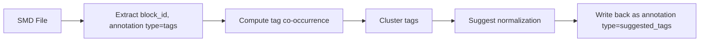

# Semantic Markdown (SMD) — Specification v0.1

> A **block-addressable, graph-structured document format** for representing documents as evolving semantic graphs.

**Status:** Active Research  
**Last updated:** 2026-06-09  
**Extension:** `.smd`  
**MIME:** `text/vnd.semantic-markdown` (pending IANA registration)  
**License:** [MIT](https://opensource.org/licenses/MIT)

---

## 0. Overview

Semantic Markdown (SMD) is designed for representing documents as evolving semantic graphs. An SMD document is composed of:

- **blocks** (nodes) — addressable content units
- **typed edges** (relationships) — directional links between blocks
- **annotations** (semantic overlays) — schema-free metadata on blocks and edges

SMD targets:
- LLM-native memory systems
- Retrieval-augmented reasoning (graph RAG)
- Collaborative structured documents
- Evolving knowledge graphs embedded in text

---

## 1. Core Data Model

An SMD document is formally defined as a typed, attributed multigraph:

$$
G = (B, E, A)
$$

Where:

| Symbol | Meaning |
|---|---|
| $B$ | Set of blocks (vertices) |
| $E$ | Set of typed edges over $B \times B$ |
| $A$ | Set of annotations over $B \cup E$ |

Properties:

- **Directed.** Edges have direction unless explicitly symmetric.
- **Labeled.** Every edge has a type.
- **Multi-annotation.** Multiple annotations per node/edge are allowed.
- **Time-evolving.** The graph evolves via agent interaction (see [§12](#12-execution-semantics-layer)).

---

## 2. Block Model

A block is the atomic unit of content.

### 2.1 Definition

$$
b \in B
$$

$$
b = (\text{block\_id}, \text{document\_id?}, \text{body}, \text{meta?})
$$

A block is **minimal by design**. Everything beyond identity and content — tags, sentiment, entities, summaries, structure — is represented via annotations or edges.

### 2.2 JSON Schema

```json
{
  "block_id": "string (REQUIRED)",
  "document_id": "string (OPTIONAL)",
  "meta": "object (OPTIONAL)"
}
```

### 2.3 Serialization

```smd
@block
{
    "block_id": "b-001",
    "document_id": "doc-001",
    "meta": {}
}
---
<body (Markdown)>
```

### 2.4 Constraints

- `block_id` MUST be unique within the containing document.
- Global uniqueness is via the `(document_id, block_id)` tuple. When blocks are moved across documents, `document_id` MUST be updated.
- body MAY be empty (empty string is valid).
- JSON header MUST be valid [RFC 8259](https://tools.ietf.org/html/rfc8259).

---

## 3. Document Model

A document is the top-level container.

### 3.1 Definition

$$
d \in D
$$

$$
d = (\text{document\_id}, \text{schema\_version}, \text{meta?})
$$

### 3.2 JSON Schema

```json
{
  "document_id": "string (REQUIRED)",
  "schema_version": "string (RECOMMENDED)",
  "created": "ISO-8601 (OPTIONAL)",
  "source": "string (OPTIONAL)",
  "type": "string (OPTIONAL)",
  "meta": "object (OPTIONAL)"
}
```

### 3.3 Serialization

```smd
@document
{
    "document_id": "doc-001",
    "schema_version": "0.1",
    "created": "2026-06-09T00:00:00Z",
    "source": "research-aapl.smd",
    "type": "notebook",
    "meta": {}
}
---
```

### 3.4 Constraints

- `document_id` MUST be present. UUIDv7 or unique slug recommended.
- `schema_version` SHOULD be present for migration support.
- Each `.smd` file MAY contain multiple documents, parsed sequentially (not nested).
- The body is optional — a document may exist solely as a container for blocks.

---

## 4. Edge Model

Edges define typed relationships between blocks.

### 4.1 Definition

$$
e \in E
$$

$$
e = (\text{source}, \text{target}, \text{edge\_type}, \text{meta?})
$$

### 4.2 Standard Edge Types

| Type | Semantics | Example |
|---|---|---|
| `parent-of` | Hierarchical containment. A contains B. | Section → Subsection |
| `references` | Cross-reference or citation. A cites B. | Analysis → Source |
| `derived-from` | Provenance chain. A was generated from B. | Summary → Transcript |
| `temporal-order` | Time sequencing. A precedes B. | Day N → Day N+1 |

Additional edge types MAY be defined by applications.

### 4.3 Serialization (via annotation)

Edges are stored as annotations with `type: "edge"`:

```json
{
  "type": "edge",
  "payload": {
    "edge_type": "parent-of",
    "source": "b-001",
    "target": "b-002"
  },
  "provenance": {
    "source": "human",
    "timestamp": "2026-06-09T00:00:00Z"
  }
}
```

Edges MAY be stored:
- In the source block's `meta.annotations`
- In a dedicated `@document`-level annotation block
- In an external edge index

### 4.4 Constraints

- Edges MUST reference valid `block_id` values (if resolvable).
- Edges are directional unless explicitly declared symmetric.
- Dangling edges (target block not found) SHOULD be preserved as unresolved references.

---

## 5. Annotation Model

Annotations are optional, schema-free semantic overlays.

### 5.1 Definition

$$
a \in A
$$

$$
a = (\text{type}, \text{payload}, \text{provenance}, \text{target})
$$

Where $\text{target} \in B \cup E$ — annotations attach to blocks or edges.

### 5.2 JSON Schema

```json
{
  "type": "string (REQUIRED)",
  "payload": "object (REQUIRED)",
  "provenance": {
    "source": "string",
    "model": "string (OPTIONAL)",
    "timestamp": "ISO-8601"
  }
}
```

### 5.3 Standard Annotation Types

| Type | Meaning | Example Payload |
|---|---|---|
| `tags` | Categorical labels | `{ "values": ["inflation", "macro"] }` |
| `sentiment` | Polarity / score | `{ "score": 0.74, "label": "positive" }` |
| `summary` | Compressed meaning | `{ "text": "Fed signals tightening." }` |
| `entities` | Named entities | `{ "values": ["AAPL", "Services"] }` |
| `highlights` | Key excerpts | `{ "excerpts": ["Revenue up 12%..."] }` |
| `edge` | Structural relationship | `{ "edge_type": "parent-of", "source": "...", "target": "..." }` |
| `embedding` | Vector representation | `{ "vector": [0.1, ...], "model": "text-embedding-3" }` |

### 5.4 Design Properties

- **Schema-free.** No fixed schema for `payload`. Each `type` defines its own contract.
- **Provenance-tracked.** Every annotation records its origin, enabling audit trails and conflict resolution.
- **Mutable independently.** Annotations can be added, updated, or removed without touching the block body.
- **Multi-source.** Multiple annotations of the same `type` from different sources can coexist.
- **External or inline.** Annotations MAY be stored in a block's `meta` field, a sidecar file, or an external annotation store.

### 5.5 Example

```smd
@block
{
    "block_id": "qa-0001",
    "meta": {
        "annotations": [
            {
                "type": "tags",
                "payload": { "values": ["guidance", "revenue"] },
                "provenance": { "source": "human", "timestamp": "2026-06-07T18:30:00Z" }
            },
            {
                "type": "sentiment",
                "payload": { "score": 0.74, "label": "positive", "confidence": 0.88 },
                "provenance": { "source": "sentiment-agent-v2", "model": "finbert-sentiment", "timestamp": "2026-06-07T18:31:00Z" }
            },
            {
                "type": "summary",
                "payload": { "text": "Guidance beat consensus by ~2%." },
                "provenance": { "source": "summarizer", "model": "gpt-4", "timestamp": "2026-06-07T18:32:00Z" }
            }
        ]
    }
}
---
**Michael Ng:** Can you talk about Q4 guidance?

**Luca Maestri:** We expect low double digits...
```

---

## 6. Body Model

The block body is a structured text container supporting typed segments.

### 6.1 Segment Types

Body parsing MUST operate on raw text after the separator, not on a rendered Markdown AST.

- **markdown** — Raw Markdown text between fenced blocks.
- **fenced** — Content between ` ```type ... ``` ` extracted as a typed payload.

### 6.2 Parsing Rule

The body is split into an ordered list:

$$
\text{segments} = [(\text{type}, \text{content})_i]
$$

### 6.3 Example

```smd
@block { "block_id": "b-001" }
---
Some markdown content...

```thought
This is my internal reasoning.
```

```action_item
Review dataset pipeline. Assigned to: Alice
```
```

Parser output:

```json
[
  { "type": "markdown", "content": "Some markdown content...\n\n" },
  { "type": "thought", "content": "This is my internal reasoning." },
  { "type": "markdown", "content": "\n" },
  { "type": "action_item", "content": "Review dataset pipeline. Assigned to: Alice" }
]
```

---

## 7. Parsing Rules

### 7.1 Entity Detection

Entities start at line `^@document` or `^@block` (no leading whitespace allowed).

### 7.2 Header–Body Separator

The **first** occurrence of `^---$` (three dashes on their own line) after the `@document`/`@block` line ends the JSON header and begins the body. Only a `---` line in the header-body boundary context is structural — `---` lines within body content (Markdown horizontal rules, code blocks) are literal text with no structural significance.

```
@block
{
    "block_id": "b-001"
}
---              ← separator
Content body     ← body
```

### 7.3 Body Termination

A block/document body ends at:
- The next `@document` or `@block` line
- End of file

### 7.4 Formal Grammar (EBNF)

```ebnf
smd_file        = { entity } , EOF;

entity          = document | block;

document        = "@document", newline, json_header, separator, body;
block           = "@block", newline, json_header, separator, body;

json_header     = valid_json_object ;  (* MUST be valid RFC 8259 JSON *)
separator       = newline, "---", newline;
body            = { any_character };

newline         = "\n" | "\r\n";
any_character   = ? any Unicode character except EOF ?;
```

This grammar defines syntactic structure only. It does not define semantic validity of JSON fields or annotation schemas.

---

## 8. Parser Algorithm

```
function parse_smd(text: string): Entity[] {
    entities = []

    // 1. Split on @document or @block at line start
    raw_blocks = text.split(/^(?=@(?:document|block))/m)

    for raw in raw_blocks:
        if raw matches "^@document" or raw matches "^@block":
            entity = {}

            // 2. Determine entity type
            entity.type = raw matches "@document" ? "document" : "block"

            // 3. Locate first --- separator
            sep_pos = raw.indexOf("\n---\n")
            if sep_pos == -1:
                raise ParseError("Missing '---' separator")

            // 4. Extract JSON header
            header_start = raw.indexOf("\n") + 1
            header_text = raw[header_start:sep_pos].trim()
            entity.header = JSON.parse(header_text)

            // 5. Extract body
            body_text = raw[sep_pos + 5:].trim()
            entity.segments = parse_body(body_text)

            entities.append(entity)

    return entities
}
```

**Time complexity:** $O(n)$ — single pass, no backtracking. Streaming parsers are possible with line-delimited input.

---

## 9. Identifiers

### 9.1 `block_id`

- **REQUIRED** on every `@block`.
- MUST be unique within the containing document.
- SHOULD be stable across edits.
- RECOMMENDED conventions: UUIDv7 (time-sortable), slugs (`qa-0042`, `day-2026-01-15`), or path-style IDs (`section/methodology/wacc`).

### 9.2 `document_id`

- **REQUIRED** on every `@document`.
- SHOULD be globally unique and stable across systems.
- RECOMMENDED: UUIDv7 or a unique slug.

### 9.3 Referencing

Blocks reference each other via typed edges (see [§4](#4-edge-model)). The `parent-of` edge type establishes hierarchy:

```smd
@block { "block_id": "ch-1" }
---
## Overview

@block
{
    "block_id": "sec-1",
    "meta": {
        "annotations": [
            {
                "type": "edge",
                "payload": { "edge_type": "parent-of", "source": "ch-1", "target": "sec-1" },
                "provenance": { "source": "human", "timestamp": "2026-01-01T00:00:00Z" }
            }
        ]
    }
}
---
### Details
```

---

## 10. Graph Semantics

### 10.1 Formal Properties

SMD defines a typed multigraph:

$$
G = (B, E, A)
$$

- **Nodes** = blocks
- **Edges** = typed relations
- **Annotations** = overlays on nodes and edges

Properties:

| Property | Value |
|---|---|
| Directed | Yes (edges have direction) |
| Labeled | Yes (every edge has a type) |
| Multi-annotation | Allowed (multiple annotations per node/edge) |
| Time-evolving | Yes (versioned via annotation timestamps) |

### 10.2 Why a Graph?

- **Trees are insufficient.** Documents contain cross-references, temporal sequences, and derivation chains that trees cannot express.
- **Edges are typed.** Unlike generic hyperlinks, typed edges carry semantics that algorithms can reason about.
- **Annotations attach anywhere.** Sentiment, tags, summaries — all overlay the graph without polluting the vertex schema.
- **Structure is emergent.** The graph is discovered or declared, not mandated by the format.

---

## 11. Query Model

Queries operate over the document graph $G = (B, E, A)$, not over raw text. SMD defines a minimal query algebra:

$$
Q :=
    \text{filter}(\text{annotation\_type}, \text{predicate}) \mid
    \text{traverse}(\text{edge\_type}, \text{direction?}) \mid
    \text{match}(\text{text\_query}) \mid
    \text{embed\_search}(\text{vector}) \mid
    \text{aggregate}(\text{metric}, \text{group?})
$$

### 11.1 Query Operators

| Operator | Signature | Description |
|---|---|---|
| `filter` | $\text{filter}(t, p) \to B'$ | Select blocks where an annotation of type $t$ matches predicate $p$. Example: `filter("sentiment", score > 0.7)` |
| `traverse` | $\text{traverse}(e, d?) \to B'$ | Follow edges of type $e$ from a set of blocks. $d$ is `out` (default), `in`, or `both`. |
| `match` | $\text{match}(q) \to B'$ | Full-text or regex match over block bodies. |
| `embed_search` | $\text{embed\_search}(v) \to B'$ | Semantic (vector) similarity search over block bodies or embedding annotations. |
| `aggregate` | $\text{aggregate}(m, g?) \to \text{scalar} \mid \text{map}$ | Compute `count`, `sum`, `avg`, `min`, `max` over annotation payloads, optionally grouped. |

### 11.2 Composition

Queries compose via piping:

$$
Q = \text{filter} \rightarrow \text{traverse} \rightarrow \text{filter}
$$

```
filter("tags", contains("valuation"))
  → traverse("references", out)
  → filter("sentiment", score < 0.3)
```

Which reads: "Find valuation-tagged blocks, follow their references, and return those with negative sentiment."

### 11.3 Retrieval-Augmented Generation (RAG)

SMD is designed for RAG retrieval with graph context:

```
┌──────────────────┐     ┌──────────────────┐     ┌──────────────────┐
│  User query      │────▶│  embed_search()  │────▶│  traverse()      │
│                  │     │  → top-k blocks  │     │  → neighbor      │
│                  │     │                  │     │    blocks        │
└──────────────────┘     └──────────────────┘     └────────┬─────────┘
                                                           │
                                                           ▼
┌──────────────────┐     ┌──────────────────────────────────────────┐
│  LLM response    │◀────│  Build context window from blocks +      │
│                  │     │  annotations + edges                     │
└──────────────────┘     └──────────────────────────────────────────┘
```

The graph structure $G = (B, E, A)$ means retrieval is never limited to isolated text chunks — neighbor blocks, typed edges, and annotations are always available for context assembly.

### 11.4 Implementation Note

This query algebra is **a specification, not a mandated implementation**. Systems MAY implement it via:
- In-memory graph traversal (small documents)
- SQL/vector hybrid stores (production scale)
- Custom query compilers targeting specific backends

---

## 12. Execution Semantics Layer

This section defines how LLM-based agents and retrieval systems ground their interactions in SMD's graph structure — transforming SMD from a document format into an **LLM memory operating system**.

The execution semantics layer sits above the query algebra (§11), defining how queries map to retrieval, how retrieved subgraphs are assembled into context windows, and how agents write back to the document graph.

---

### 12.1 Primitives

Agents interact with SMD documents through four primitives. No direct modification of the block body is required for semantic updates — agents annotate, link, and update metadata rather than rewriting content.

| Primitive | Signature | Operation | Target |
|---|---|---|---|
| $\text{READ}$ | $\text{READ}(b) \to (\text{body}, A_b, E_b)$ | Retrieve block $b$, its annotations, and incident edges | $B$ |
| $\text{WRITE}$ | $\text{WRITE}(a) \to a$ | Add or update an annotation on a block or edge | $A$ |
| $\text{LINK}$ | $\text{LINK}(e) \to e$ | Create or modify a typed edge between blocks | $E$ |
| $\text{UPDATE}$ | $\text{UPDATE}(b, m) \to b$ | Modify block-level metadata (not body) | $B$ |

#### 12.1.1 Invariants

- **READ** does not modify the graph. It returns the block body, all annotations attached to that block, and all edges incident to that block.
- **WRITE** annotations are additive by default. When the same `(type, target, provenance.source)` tuple exists, behavior is implementation-defined (last-write-wins, version-stack, or CRDT merge).
- **LINK** MUST reference valid `block_id` values when resolvable. Dangling links (target not yet indexed) are stored as unresolved and MAY be validated lazily.
- **UPDATE** affects `meta` only — it does not modify `block_id`, `document_id`, or body content. Block identity is immutable.

---

### 12.2 Graph-Grounded Retrieval

Retrieval in SMD is never a flat top-k text search. Every retrieval operation is grounded in the document graph $G = (B, E, A)$.

#### 12.2.1 Retrieval Function

$$
R(q, G) = (B_{\text{seed}}, E_{\text{expand}}, A_{\text{select}})
$$

Where:
- $B_{\text{seed}}$ — seed blocks retrieved by the query (§11)
- $E_{\text{expand}}$ — edges traversed from seed blocks to expand context
- $A_{\text{select}}$ — annotations selected from the expanded subgraph (see §12.4)

#### 12.2.2 Expansion Strategies

| Strategy | Description | Use Case |
|---|---|---|
| $\text{neighbor}(k)$ | Traverse all edges from seed blocks up to $k$ hops | General RAG — pull in related context |
| $\text{typed}(e, k)$ | Traverse only edges of type $e$ up to $k$ hops | Targeted: follow only `references` or `parent-of` |
| $\text{temporal}(n)$ | Follow `temporal-order` edges $\pm n$ steps from seed | Notebooks, timelines, sequential documents |
| $\text{subtree}$ | Follow `parent-of` inward and outward to get full section | Hierarchical documents |
| $\text{provenance}$ | Follow `derived-from` edges to source blocks | Fact-checking, source attribution |

#### 12.2.3 Expansion Algorithm

```
function retrieve_and_expand(query, G, strategy, k):
    // 1. Seed retrieval (from §11 query algebra)
    seeds = Q(query).execute(G)          // embed_search, match, filter

    // 2. Graph expansion
    expanded = seeds
    frontier = seeds
    for hop in 1..k:
        next_frontier = []
        for block in frontier:
            for edge in G.edges_from(block, strategy.type):
                neighbor = edge.target
                if neighbor not in expanded:
                    expanded.add(neighbor)
                    next_frontier.add(neighbor)
        frontier = next_frontier

    // 3. Annotate the subgraph
    subgraph = (expanded, G.edges_subset(expanded), G.annotations_subset(expanded))
    return subgraph
```

---

### 12.3 Context Window Construction

The retrieved subgraph must be assembled into a context window suitable for an LLM prompt. This is the projection function from graph to text.

#### 12.3.1 Context Window Function

$$
C(B_{\text{ctx}}, A_{\text{sel}}) = \text{assemble}(B_{\text{ctx}}, A_{\text{sel}})
$$

Where $B_{\text{ctx}}$ is the set of blocks in the expanded subgraph and $A_{\text{sel}}$ is the set of selected annotations.

#### 12.3.2 Assembly Rules

The context window is assembled as an ordered sequence of **context entries**, one per block:

```
[CONTEXT BLOCK: b-001]
[ANNOTATIONS: sentiment=positive, tags=[inflation, macro]]
Block body text goes here...

[CONTEXT BLOCK: b-002]
[ANNOTATIONS: summary="Fed signals caution..."]
More block body text...
```

#### 12.3.3 Ordering

Blocks in the context window are ordered by a configurable sort key:

| Ordering | Key | Best For |
|---|---|---|
| $\text{relevance}$ | Query similarity score (descending) | Open-ended Q&A |
| $\text{temporal}$ | `created` timestamp or `temporal-order` edges | Timelines, notebooks |
| $\text{topological}$ | Graph distance from seed (BFS order) | Hierarchical navigation |
| $\text{hybrid}$ | Weighted combination of relevance + graph distance | General purpose |

#### 12.3.4 Budget Management

Context windows have finite token budgets. SMD defines a budget allocation strategy:

1. **Reserve** $t_{\text{reserve}}$ tokens for system prompt and query
2. **Allocate** remaining $t_{\text{budget}}$ tokens across blocks
3. **Prioritize** seed blocks — allocate up to $t_{\text{max\_per\_block}}$ each
4. **Expand** — fill remaining budget with neighbor blocks
5. **Truncate** — if budget exhausted, drop lowest-priority blocks, then truncate bodies

$$
t_{\text{available}} = t_{\text{context\_window}} - t_{\text{reserve}}
$$

---

### 12.4 Annotation Selection

Not all annotations are surfaced into every context window. Annotation selection determines which metadata accompanies each block into the prompt.

#### 12.4.1 Selection Function

$$
\text{select}(A, q, b) \to A' \subseteq A
$$

Where $A$ is all annotations for blocks in the context, $q$ is the query, and $b$ is the target block.

#### 12.4.2 Selection Policies

| Policy | Rule | Use Case |
|---|---|---|
| $\text{all}$ | Include all annotations for every block in context | Debugging, full inspection |
| $\text{typed}(T)$ | Include only annotations whose type $\in T$ | Targeted: only `summary` + `tags` |
| $\text{query-relevant}$ | Include annotations whose payload matches query terms | Reduce noise — only show relevant metadata |
| $\text{provenance-filtered}(S)$ | Include only annotations from sources $\in S$ | Trusted-source only |
| $\text{top-k-per-type}$ | Include at most $k$ annotations per type, ordered by recency | Budget-constrained windows |

#### 12.4.3 Default Policy (Recommended)

For general-purpose RAG, the recommended default is:

```
select = typed({"summary", "tags", "entities", "sentiment"})
```

This surfaces semantic metadata (what the block is about, how it feels) while suppressing structural noise (embeddings, edge definitions, raw highlights).

---

### 12.5 Prompt Assembly Pipeline

The full pipeline from query to LLM-ready prompt:

```
┌──────────┐    ┌──────────────┐    ┌───────────────┐    ┌──────────────┐    ┌──────────┐
│  Query   │───▶│  Retrieval   │───▶│  Expansion    │───▶│  Assembly    │───▶│  Prompt  │
│  q       │    │  R(q, G)     │    │  (hop=k)     │    │  C(B, A')   │    │          │
└──────────┘    └──────────────┘    └───────────────┘    └──────────────┘    └──────────┘
                      │                    │                   │
                      ▼                    ▼                   ▼
               B_seed = Q(q)        B_ctx = expand(      context_window =
               .execute(G)          B_seed, strategy)    assemble(B_ctx,
                                                          select(A, q))
```

#### 12.5.1 Formal Definition

$$
\text{prompt}(q, G) = \text{system\_prompt} \oplus \text{assemble}(B_{\text{ctx}}, \text{select}(A_{\text{ctx}}, q)) \oplus q
$$

Where $\oplus$ denotes concatenation in the order: system prompt, assembled context blocks, user query.

#### 12.5.2 Agent Write-Back

After the LLM produces a response, the agent MAY write back to the document graph:

```
Agent:  WRITE({ "type": "response", "payload": { "text": "...", "in_response_to": "q" },
                "provenance": { "source": "rag-agent", "model": "gpt-4", "timestamp": "..." },
                "target": "qa-0001" })
        → annotates the queried block with the agent's response

Agent:  LINK({ "type": "edge", "payload": { "edge_type": "derived-from", "source": "resp-0042", "target": "qa-0001" },
              "provenance": { "source": "rag-agent" } })
        → links a new response block back to the source
```

This write-back loop is what transforms SMD from a passive format into an **evolving memory** — each interaction enriches the graph for future retrieval.

---

### 12.6 Example: Full Retrieval + Assembly

```
Query: "What's the Fed's stance on inflation?"

Step 1 — Retrieval:
  embed_search("Fed inflation stance") → B_seed = {sec-inflation, sec-rates}

Step 2 — Expansion (typed="references", k=1):
  traverse("references") from seeds → B_ctx += {sec-cpi, sec-pce}

Step 3 — Annotation Selection (typed={"summary", "tags", "entities", "sentiment"}):
  select(A_ctx, q) → keep summaries, tags, entities; drop embeddings, raw edges

Step 4 — Assembly (ordering=relevance):
  [CONTEXT BLOCK: sec-inflation]
  [tags: inflation, cpi, policy]
  [summary: "Fed expresses caution on inflation persistence"]
  [entities: CPI, PCE, fed funds rate]
  Participants noted that inflation remains elevated...

  [CONTEXT BLOCK: sec-cpi]
  [tags: cpi, data]
  [sentiment: {score: -0.2, label: "slightly negative"}]
  CPI rose 0.3% month-over-month...

Step 5 — Prompt:
  system_prompt + assembled_context + query → LLM
```

---

### 12.7 Example Session

```
Agent:  READ("qa-0001")
        → returns block body + annotations + incident edges

Agent:  WRITE({ "type": "sentiment", "payload": { "score": 0.82 }, ... })
        → adds sentiment annotation to qa-0001

Agent:  LINK({ "type": "edge", "payload": { "edge_type": "references",
          "source": "qa-0001", "target": "sec-inflation" }, ... })
        → creates cross-reference edge

Agent:  UPDATE("qa-0001", { "meta": { "reviewed": true } })
        → marks block as reviewed
```

---

## 13. Clustering Pipelines

Because annotations carry free-form payloads, SMD is naturally amenable to bottom-up structure discovery.

### 13.1 Tag Clustering Pipeline



### 13.2 Example Output

```
Input blocks:
  b1: ["dcf", "valuation", "wacc"]
  b2: ["dcf model", "valuation", "terminal growth"]
  b3: ["ai", "capex"]
  b4: ["ai", "nvda", "chip"]
  b5: ["amd", "mi350", "chip"]

Cluster 1: "valuation" → normalize "dcf", "dcf model" → "dcf"
Cluster 2: "ai_capex" → normalize "ai", "capex" → "ai_capex"
Cluster 3: "competition" → normalize "nvda", "amd", "mi350", "chip" → "competition"
```

### 13.3 Feedback Loop

```smd
@block
{
    "block_id": "b1",
    "meta": {
        "annotations": [
            {
                "type": "tags",
                "payload": { "values": ["dcf", "valuation"] },
                "provenance": { "source": "human" }
            },
            {
                "type": "suggested_tags",
                "payload": { "values": ["dcf"] },
                "provenance": { "source": "clustering-pipeline", "timestamp": "2026-06-09T00:00:00Z" }
            },
            {
                "type": "cluster",
                "payload": { "group": "valuation_group" },
                "provenance": { "source": "clustering-pipeline", "timestamp": "2026-06-09T00:00:00Z" }
            }
        ]
    }
}
```

No format changes needed — the pipeline writes into the existing `meta.annotations` field.

---

## 14. Conformance Levels

This specification uses the key words **MUST**, **SHOULD**, and **MAY** as defined in [RFC 2119](https://tools.ietf.org/html/rfc2119).

| Level | Meaning |
|---|---|
| **MUST** | Required for valid SMD. Parsers MUST reject documents that violate these rules. |
| **SHOULD** | Recommended for interoperability. Parsers SHOULD warn on deviation. |
| **MAY** | Optional extensions. Implementations MAY choose to support or ignore. |

### 14.1 Conformance Rules

| Rule | Level | Scope |
|---|---|---|
| `block_id` unique within document | MUST | All blocks |
| JSON header is valid RFC 8259 | MUST | All entities |
| `---` separator present after header | MUST | All entities |
| `@document`/`@block` at line start | MUST | Parser |
| `document_id` on @document | SHOULD | Document |
| `schema_version` on @document | SHOULD | Document |
| Block body present (may be empty) | MUST | All blocks |
| Annotations carry provenance | SHOULD | Annotation producers |
| Edges reference valid block_ids | SHOULD | Edge producers |
| Viewers interpret annotations | MAY | Viewer |
| Cross-document aggregation | MAY | Viewer / Indexer |
| Clustering pipelines | MAY | External tools |

---

## 15. Error Model

| Condition | Behavior |
|---|---|
| `@block` with no `---` separator | Raise `ParseError`. Invalid document. |
| Malformed JSON in header | Raise `ParseError` with line number. |
| Duplicate `block_id` within document | Raise `ParseError`. |
| `@document` inside another document | Parsed as a new document (sequential, not nested). |
| Unknown fenced block type | Treated as plain markdown in body; typed segment still emitted. |
| Unknown annotation type | Ignored or pass-through. No error. |
| Dangling edge reference | Preserved as unresolved; MAY emit warning. |
| Empty body | Valid. `segments` is an empty list. |

---

## 16. Schema Versioning

The `schema_version` field on `@document` enables format evolution while maintaining backward compatibility.

### 16.1 Versioning Rules

- **Minor version changes** (e.g., `0.1` → `0.2`) MUST be backward compatible at the parser level. Documents written for an older minor version MUST parse successfully under a newer minor version.
- **Major version changes** (e.g., `0.x` → `1.0`) MAY introduce breaking changes. Parsers SHOULD reject documents with an unsupported major version.
- **Pre-1.0** (current): All `0.x` versions are considered experimental. Breaking changes between `0.x` releases SHOULD be documented but are permitted.

### 16.2 Migration

When a new schema version introduces changes to the data model, migration tools MAY transform documents by:

1. Parsing the document under the old schema
2. Mapping fields to the new schema
3. Updating `schema_version` and `meta.migrated_from`
4. Writing back as valid SMD

### 16.3 Version Declaration

```smd
@document
{
    "document_id": "aapl-q3-2026",
    "schema_version": "0.1",
    ...
}
```

---

## 17. Non-Normative: Viewer Semantics

Rendering is a **projection function** and is not part of the SMD validity model:

$$
P(\text{view}) : (B, E, A) \to \text{UI}
$$

### 17.1 Non-Normative Status

- SMD **MUST NOT** define colors, UI layouts, or rendering rules.
- SMD **MUST NOT** require specific visual treatments of annotations.
- Renderers **MAY** interpret annotations however they want — as overlays, sidebars, filters, or ignore them entirely.
- The format defines *what* data is available; renderers define *how* to display it.
- SMD does NOT define storage backends — these are implementation-specific.

### 17.2 Common Rendering Patterns (Informative)

The following patterns are observed in practice but are **not required**:

- **Tag-based filtering:** Extract annotation `type: "tags"` payloads to build filter interfaces.
- **Sentiment gradients:** Map annotation `type: "sentiment"` scores to color scales.
- **Entity linking:** Hyperlink annotation `type: "entities"` payload values.
- **Edge visualization:** Render `type: "edge"` annotations as connector lines or hierarchy trees.
- **Cross-document aggregation:** Scan annotations across multiple `.smd` files for global views.

### 17.3 Viewer Architecture (Informative)

```
┌──────────────┐     ┌──────────────────┐     ┌───────────────────┐
│  .smd files   │────▶│  Parser          │────▶│  Viewer           │
│  (one or     │     │  (B, E, A)       │     │                   │
│  many)       │     │                   │     │  P(view): graph   │
│              │     │  B = blocks      │     │  → UI projection  │
│              │     │  E = edges       │     │                   │
│              │     │  A = annotations │     │  (colors, layout, │
│              │     │                   │     │   filters, etc.) │
└──────────────┘     └──────────────────┘     └───────────────────┘
```

---

## 18. Comparison with Alternatives

| Feature | Plain MD | JSON | YAML+MD | MDX | SMD |
|---|---|---|---|---|---|
| Human-readable body | ✅ | ❌ | ✅ | ✅ | ✅ |
| Machine-parseable metadata | ❌ | ✅ | ✅ (file) | ❌ | ✅ (block) |
| Block-level addressing | ❌ | ❌ | ❌ | ❌ | ✅ |
| Block-level annotations | ❌ | ✅ | ❌ | ❌ | ✅ |
| Provenance tracking | ❌ | ❌ | ❌ | ❌ | ✅ |
| Typed document graph | ❌ | ❌ | ❌ | ❌ | ✅ |
| Formal query algebra | ❌ | ❌ | ❌ | ❌ | ✅ |
| Emergent clustering | ❌ | Partial | ❌ | ❌ | ✅ |
| Agent execution model | ❌ | ❌ | ❌ | ❌ | ✅ |
| Git-friendly | ✅ | ✅ | ✅ | ✅ | ✅ |
| No proprietary tools | ✅ | ✅ | ✅ | ❌ | ✅ |
| Semantic retrieval at scale | ❌ | ❌ | ❌ | ❌ | ✅ |

---

## 19. Use Cases

### 19.1 Earnings Transcript (Q&A blocks)

```smd
@document
{
    "document_id": "aapl-q3-2026",
    "schema_version": "0.1",
    "created": "2026-06-07T18:30:00Z",
    "source": "AAPL Q3 2026 Earnings Call",
    "meta": { "ticker": "AAPL", "fiscal_quarter": "Q3", "fiscal_year": 2026 }
}
---
@block
{
    "block_id": "qa-0001",
    "meta": {
        "annotations": [
            {
                "type": "tags",
                "payload": { "values": ["guidance", "revenue"] },
                "provenance": { "source": "human", "timestamp": "2026-06-07T18:30:00Z" }
            },
            {
                "type": "sentiment",
                "payload": { "score": 0.74, "label": "positive", "confidence": 0.88, "excerpt": "Guidance beat consensus by ~2%." },
                "provenance": { "source": "sentiment-agent-v2", "model": "finbert-sentiment", "timestamp": "2026-06-07T18:31:00Z" }
            },
            {
                "type": "summary",
                "payload": { "text": "Guidance beat consensus by ~2%. Services growth continues." },
                "provenance": { "source": "summarizer", "model": "gpt-4", "timestamp": "2026-06-07T18:32:00Z" }
            },
            {
                "type": "entities",
                "payload": { "values": ["AAPL", "Services"] },
                "provenance": { "source": "ner-agent", "timestamp": "2026-06-07T18:31:00Z" }
            }
        ]
    }
}
---
**Michael Ng:** Can you talk about Q4 guidance?

**Luca Maestri:** We expect low double digits...
```

### 19.2 Financial Notebook (day blocks with temporal edges)

```smd
@document
{
    "document_id": "research-aapl-2026",
    "schema_version": "0.1",
    "meta": { "title": "AAPL Research Notes" }
}
---
@block
{
    "block_id": "day-2026-01-15",
    "meta": {
        "annotations": [
            { "type": "tags", "payload": { "values": ["valuation", "dcf"] }, "provenance": { "source": "human" } },
            { "type": "edge", "payload": { "edge_type": "temporal-order", "source": "day-2026-01-15", "target": "day-2026-03-22" }, "provenance": { "source": "structure-agent" } }
        ]
    }
}
---
Updated DCF model today. WACC lowered to 9.2%.

**TODO:** Review Services revenue breakdown.
```

### 19.3 RAG Corpus (semantic chunks with vector embeddings)

```smd
@document { "document_id": "fed-minutes-2026-05", "schema_version": "0.1" }
---
@block
{
    "block_id": "sec-inflation",
    "meta": {
        "annotations": [
            { "type": "tags", "payload": { "values": ["inflation", "cpi", "policy"] }, "provenance": { "source": "indexer" } },
            { "type": "summary", "payload": { "text": "Fed expresses caution on inflation persistence" }, "provenance": { "source": "summarizer", "model": "gpt-4" } },
            { "type": "embedding", "payload": { "vector": [0.012, -0.034, ...], "model": "text-embedding-3-large" }, "provenance": { "source": "embedding-pipeline" } }
        ]
    }
}
---
Participants noted that inflation remains elevated...
```

---

## 20. Future Considerations

| Topic | Notes |
|---|---|
| **Inline block references** | A syntax like `[b-001]` or `@ref(b-001)` to reference another block from within body text. |
| **Schema validation** | Optional JSON Schema per annotation `type` to validate annotation payloads. |
| **Streaming** | Line-delimited SMD for real-time agent output (LLM streaming). |
| **Encryption per block** | Encrypted annotations at the block level for sensitive metadata. |
| **Versioning** | Git-native diff at block granularity (`block_id` as anchor). |
| **Cross-document graph merge** | Merge $G_1$ and $G_2$ with edge reconciliation. |
| **Annotation conflict resolution** | CRDT or LWW strategies for concurrent annotation writes. |

---

## 21. Minimal Example

```smd
@document
{
    "document_id": "doc-001",
    "schema_version": "0.1"
}
---
@block
{
    "block_id": "b-001",
    "meta": {}
}
---
Inflation is rising in Q2 2026.

@block
{
    "block_id": "b-002",
    "meta": {
        "annotations": [
            {
                "type": "tags",
                "payload": { "values": ["macro", "inflation"] },
                "provenance": { "source": "human", "timestamp": "2026-06-09T00:00:00Z" }
            },
            {
                "type": "edge",
                "payload": { "edge_type": "references", "source": "b-002", "target": "b-001" },
                "provenance": { "source": "human", "timestamp": "2026-06-09T00:00:00Z" }
            }
        ]
    }
}
---
Fed signals continued tightening.
```

---

## 22. License

This specification is released under the [Apache License, Version 2.0](https://www.apache.org/licenses/LICENSE-2.0).
